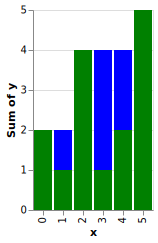
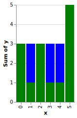
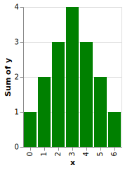
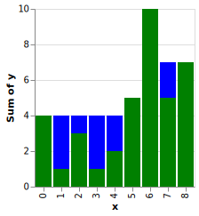

# tw.weekly.c79

The Weekly Challenge - #079 - Tyler Wardhaugh

## Usage

Run the project directly (shows default output from both tasks):

    $ clojure -m tw.weekly.c79.core

Run the project's tests (which are samples from the task descriptions):

    $ clojure -A:test:runner

Run Task #1 with input

    $ clojure -m tw.weekly.c79.t1 N

Run Task #2 with input:

    $ clojure -m tw.weekly.c79.t2 A1 A2 A3 [...]

See SVG files in the `resources` directory for the histograms drawn for each of the tests for Task 2:

## Project Template

I used Sean Corfield's clj-new to generate the project template

See [seancorfield/clj-new: Generate new projects based on clj, Boot, or Leiningen Templates!](https://github.com/seancorfield/clj-new) for more information.

## License

Copyright © 2020 Tyler Wardhaugh

Distributed under the Eclipse Public License either version 1.0 or (at
your option) any later version.
